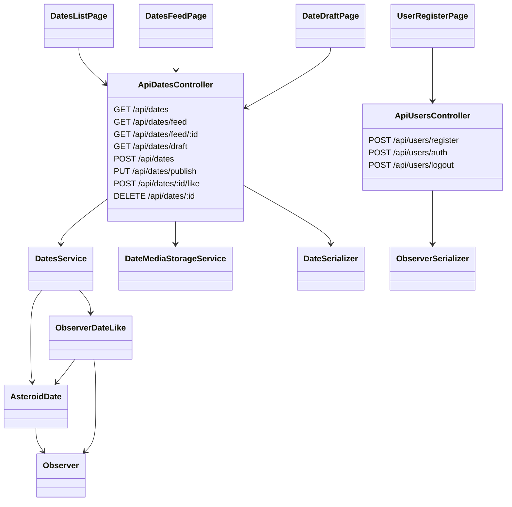

# Asteroid Dates Backend

Бэкенд лабораторной 3 для SPA про даты сближения астероидов с Землей. Все API-методы начинаются с `/api`, работают через NestJS + TypeORM + PostgreSQL, а удаленные записи клиенту не отдаются.

## Запуск

```bash
npm install
npm run infra:up
npm run start:dev
```

По умолчанию медиафайлы сохраняются локально в `public/uploads/dates`. Для Minio включите режим:

```bash
DATE_MEDIA_STORAGE=minio npm run start:dev
```

Переменные Minio: `MINIO_ENDPOINT`, `MINIO_PUBLIC_BASE_URL`, `MINIO_BUCKET`, `MINIO_ROOT_USER`, `MINIO_ROOT_PASSWORD`.

## Singleton пользователя

В лабораторной авторизация еще не реализуется, поэтому текущий пользователь зафиксирован в функции-singleton `getCurrentObserver()` из `src/services/current-observer.service.ts`. Все методы создания, публикации, удаления и лайков получают пользователя через эту функцию, а не из тела запроса.

## HTTP методы

| Метод | URL | Назначение | Тело/параметры |
| --- | --- | --- | --- |
| `GET` | `/api/dates?maxMonth=7` | Список опубликованных дат с фильтром по месяцу | `maxMonth` 1-12 |
| `GET` | `/api/dates/feed` | Первая запись ленты без id в URL | нет |
| `GET` | `/api/dates/feed/:id?next=true` | Следующая опубликованная запись по id, id могут идти с пропусками | `next=true` |
| `GET` | `/api/dates/draft` | Черновик текущего пользователя, не больше одной записи | нет |
| `POST` | `/api/dates` | Создать или обновить черновик с файлами | `multipart/form-data`: `designation`, `image`, `video` |
| `PUT` | `/api/dates/publish` | Опубликовать текущий черновик | `shortDescription`, `approachMonth`, `approachDay`, `minimumDistanceAu` |
| `POST` | `/api/dates/:id/like` | Поставить или снять лайк текущего пользователя | `like`: `1` поставить, `0` снять |
| `DELETE` | `/api/dates/:id` | Soft delete только своей записи | нет |
| `POST` | `/api/users/register` | Регистрация пользователя | `fullName`, `email` |
| `POST` | `/api/users/auth` | Заглушка аутентификации для 4 лабораторной | `email` |
| `POST` | `/api/users/logout` | Заглушка деавторизации для 4 лабораторной | нет |

Системные поля `id`, `status`, `creatorId`, `createdAt`, `formedAt` не принимаются от клиента для изменения. Они рассчитываются на бэкенде.

## Проверка в Postman/Insomnia

1. `GET /api/dates?maxMonth=7`
2. `POST /api/dates` с `designation`, `image`, `video`
3. `GET /api/dates/draft`
4. `PUT /api/dates/publish`
5. `GET /api/dates/feed`
6. `GET /api/dates/feed/2?next=true`
7. `POST /api/dates/2/like` с `{ "like": 1 }`
8. `POST /api/dates/2/like` с `{ "like": 0 }`
9. `DELETE /api/dates/:id` для своей опубликованной записи
10. `POST /api/users/register`

## Таблицы БД

### `observers`

| Поле | Тип | Описание |
| --- | --- | --- |
| `id` | serial PK | Идентификатор пользователя |
| `full_name` | varchar(80) | Имя пользователя |
| `email` | varchar(120), unique | Email пользователя |

### `asteroid_dates`

| Поле | Тип | Описание |
| --- | --- | --- |
| `id` | serial PK | Идентификатор даты |
| `designation` | varchar(120) | Обозначение астероида |
| `short_description` | varchar(700), nullable | Описание |
| `status` | varchar(16) | `draft`, `published`, `deleted` |
| `image_url` | varchar(500), nullable | Сгенерированный путь/URL изображения |
| `video_url` | varchar(500), nullable | Сгенерированный путь/URL видео |
| `approach_month` | smallint, nullable | Месяц сближения |
| `approach_day` | smallint, nullable | День сближения |
| `minimum_distance_au` | numeric(8,5), nullable | Минимальная дистанция в а.е. |
| `created_at` | timestamp | Дата создания |
| `formed_at` | timestamp, nullable | Дата публикации |
| `creator_id` | FK `observers.id` | Создатель записи |

### `observer_date_likes`

| Поле | Тип | Описание |
| --- | --- | --- |
| `id` | serial PK | Идентификатор лайка |
| `observer_id` | FK `observers.id` | Пользователь |
| `asteroid_date_id` | FK `asteroid_dates.id` | Дата |

Пара `(observer_id, asteroid_date_id)` уникальна, поэтому один пользователь может поставить только один лайк на одну дату.

## Диаграмма классов и зависимостей



## Коротко по контрольным вопросам

Веб-сервис - серверный интерфейс, который предоставляет данные и операции другим приложениям по сети. REST - стиль API, где ресурсы имеют URL, а действия задаются HTTP-методами. RPC - стиль, где клиент вызывает удаленную процедуру как команду. HTTP-заголовки передают метаданные запроса и ответа, а основные методы: `GET`, `POST`, `PUT`, `PATCH`, `DELETE`. Версии HTTP: 0.9, 1.0, 1.1, 2, 3. HTTPS - HTTP поверх TLS. Модель OSI ISO описывает 7 уровней сетевого взаимодействия: физический, канальный, сетевой, транспортный, сеансовый, представления, прикладной.
