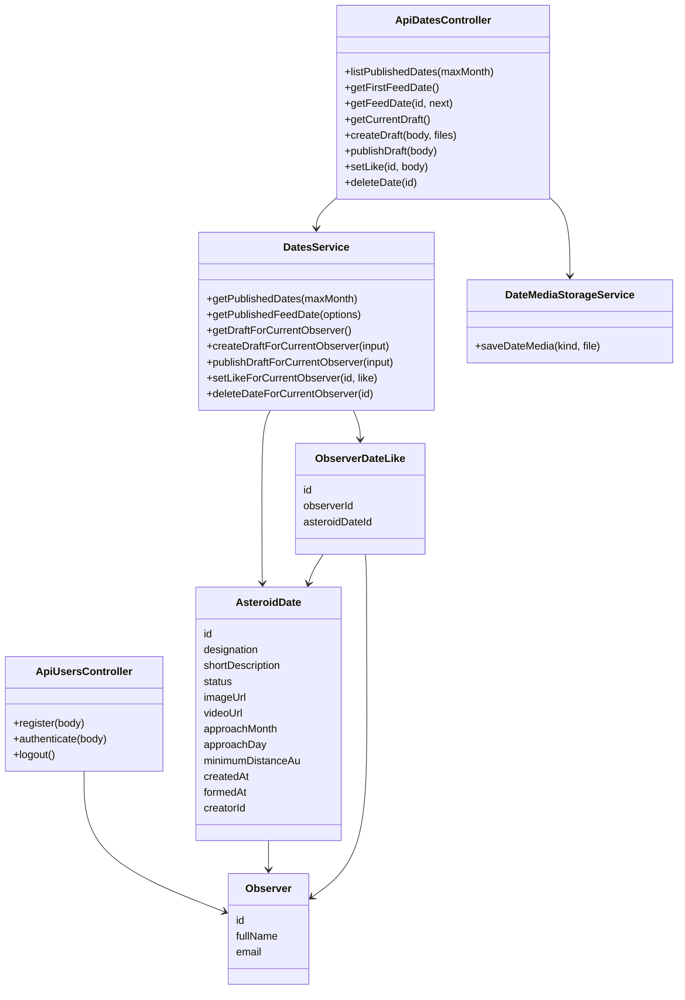

# Dates Lab 3 Class Diagram

```mermaid
classDiagram
  class ApiDatesController {
    +listPublishedDates(maxMonth)
    +getFirstFeedDate()
    +getFeedDate(id, next)
    +getCurrentDraft()
    +createDraft(body, files)
    +publishDraft(body)
    +setLike(id, body)
    +deleteDate(id)
  }

  class ApiUsersController {
    +register(body)
    +authenticate(body)
    +logout()
  }

  class DatesService {
    +getPublishedDates(maxMonth)
    +getPublishedFeedDate(options)
    +getDraftForCurrentObserver()
    +createDraftForCurrentObserver(input)
    +publishDraftForCurrentObserver(input)
    +setLikeForCurrentObserver(id, like)
    +deleteDateForCurrentObserver(id)
  }

  class DateMediaStorageService {
    +saveDateMedia(kind, file)
  }

  class AsteroidDate {
    id
    designation
    shortDescription
    status
    imageUrl
    videoUrl
    approachMonth
    approachDay
    minimumDistanceAu
    createdAt
    formedAt
    creatorId
  }

  class Observer {
    id
    fullName
    email
  }

  class ObserverDateLike {
    id
    observerId
    asteroidDateId
  }

  ApiDatesController --> DatesService
  ApiDatesController --> DateMediaStorageService
  ApiUsersController --> Observer
  DatesService --> AsteroidDate
  DatesService --> ObserverDateLike
  AsteroidDate --> Observer
  ObserverDateLike --> AsteroidDate
  ObserverDateLike --> Observer
```
